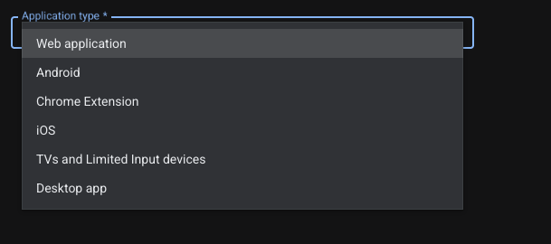
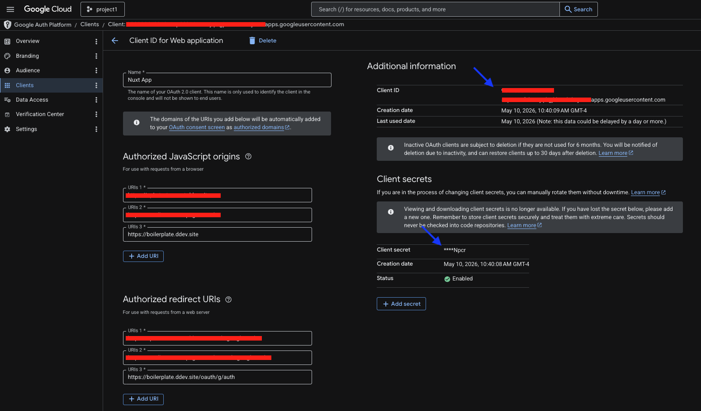

Google OAuth plugin for Craft
===

A minimal Craft plugin to provide Google OAuth login

---

## Composer | Important

Craft 4

```json
"require": {
   "leowebguy/google-oauth": "^1.0",
}
```

Craft 5

```json
"require": {
   "leowebguy/google-oauth": "^2.0",
}
```

---

## Installation

```bash
ddev composer require leowebguy/google-oauth &&
```

On your Control Panel, go to Settings → Plugins → "Google OAuth" → Install

## Credentials

Gather the necessary info from GoogleOAuth

```.dotenv
### OAUTH
GOOGLE_CLIENT_ID=111-xxx.apps.googleusercontent.com
GOOGLE_CLIENT_SECRET=AAA-123qwe
```

Go to https://console.cloud.google.com/auth/clients
1. Select a Project
2. Create client
3. Pick "Web application"



4. Give it a name
5. Add "Authorized JavaScript origins" i.e. https://myapp.ddev.site
6. Add "Authorized redirect URIs" i.e. https://myapp.ddev.site/oauth/g/auth

> The URI has to be "/oauth/g/auth" <br>
> Added to your Craft App URL i.e. https://myapp.ddev.site/oauth/g/auth



7. Copy/Save Client ID and Secret (blue arrow)
